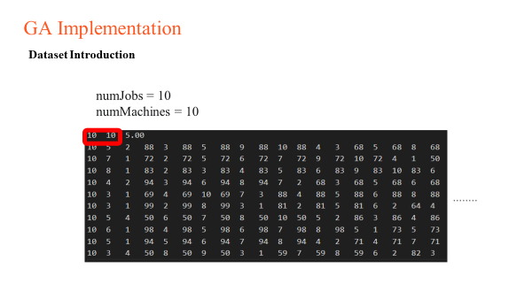
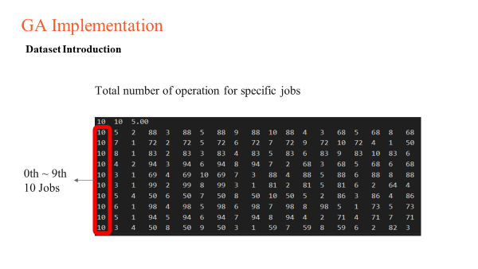
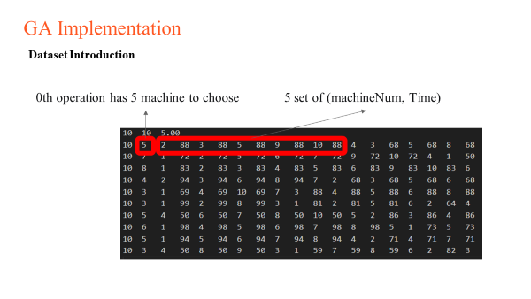
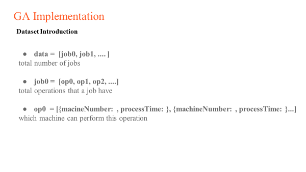

## Introductionm
This repository mainly focus on solving Felexible Job Shop Scheduling (FJJS).

Currently, we have two types of problem solved by Genetic Algorithm (GA).

> note: we use the dataset below as our baseline problem.
> We add due dates, production constraints, etc., to complicate our problem.

## Dataset 

## Ref
[Dataset reference FJSPLIB](https://people.idsia.ch/~monaldo/fjspresults/TextData.zip)
